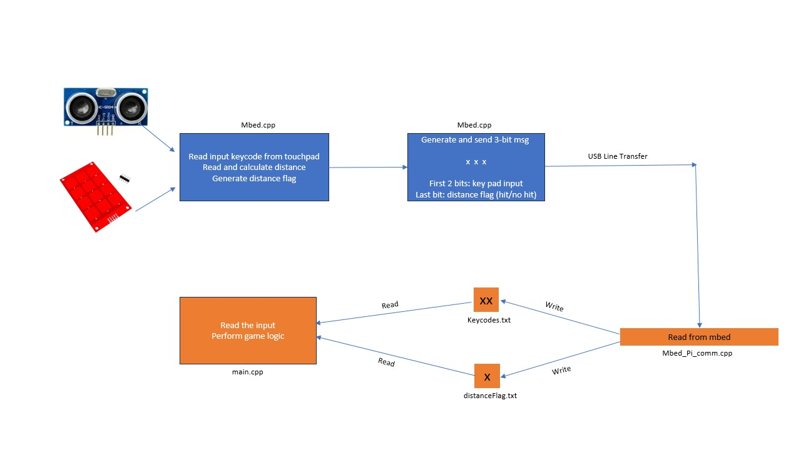
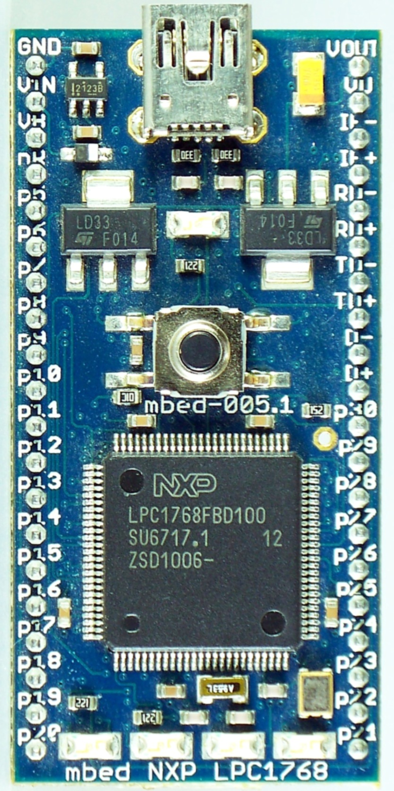
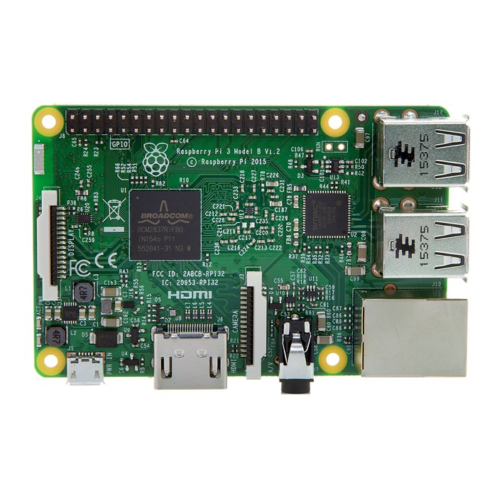
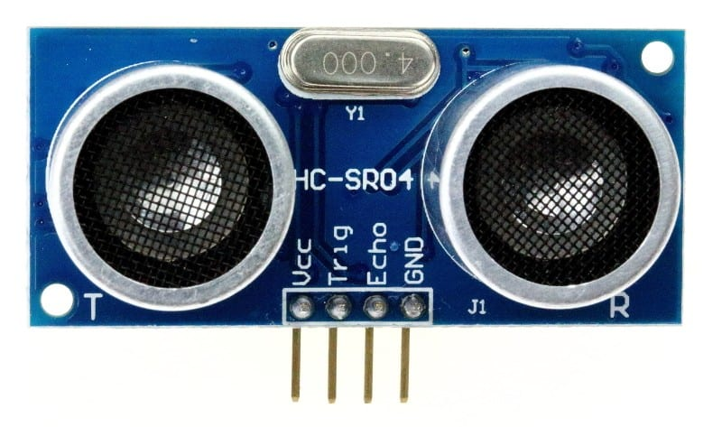
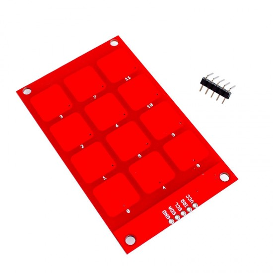
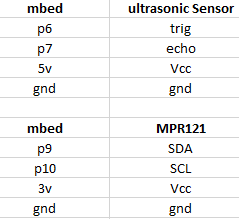

<h1 align="center">ECE4180 Final Project: Whack-A-Mole</h1>
<p align="center">by Liyuan Shen, Wensi Huang, Tianyi Chu</p>
<figure align="center">
    
</figure>

## Introduction
Welcome to our innovative version of the classic Whack-A-Mole game, reimagined with modern technology. This game offers a unique twist by incorporating an ultrasonic sensor and an MPR121 touchpad to provide a more interactive and engaging experience. 

In this game, players use the touchpad to select their desired difficulty level and to whack the moles that appear on the screen. The ultrasonic sensor adds an extra layer of interactivity, allowing players to use hand gestures to hit the moles, making the game more dynamic and physically engaging.

Our Whack-A-Mole game is not only entertaining but also demonstrates the potential of integrating various sensors and inputs into traditional gaming formats. It serves as an excellent example of how technology can be used to enhance the gaming experience, making it more immersive and enjoyable for players of all ages.


## Demo
The following video shows how the game is played.

[Video Demonstration](https://www.youtube.com/watch?v=RVkBSYTdZxs&ab_channel=shenly)

## Operation Diagram

<figure align="center">
    
</figure>

## Hardware and Wiring

<figure align="center">
    <figcaption>mbed LPC1767</figcaption>
    
</figure>

<figure align="center">
    <figcaption>Raspberry Pi 3</figcaption>
    
    
</figure>

<figure align="center">
    <figcaption>Ultrasonic Distance Sensor</figcaption>
    
    
</figure>

<figure align="center">
    <figcaption>MPR121 Touch Pad</figcaption>
    
    
</figure>

<figure align="center">
    <figcaption>Wiring</figcaption>
    
    
</figure>


## Software

The first part of of our code is to develop the mbed code that can read in the ultrasonic sensor and touchpad's output. For the touchpad, we will read its output and convert them into a 2 digit char. The ultrasonic sensor's output is read and calculated. Then, the distance is compared with a preset number to determine if a hit condition is fulfilled. If the hit condition is not triggered, a "0" flag will be appended to the touchpad's msg. Otherwise, "1" is appended. Lastly, the code will send this 3 digit msg to the Raspberry Pi 3. The code for the mbed is attached below.

```cpp
#include <mbed.h>
#include <mpr121.h>

// Setup the Serial for communication with Raspberry Pi
Serial pi(USBTX, USBRX);

// Setup the i2c bus on appropriate pins
I2C i2c(p9, p10); // Adjust pins according to your setup

// Setup the Mpr121
Mpr121 mpr121(&i2c, Mpr121::ADD_VSS);

DigitalOut led1(LED1);
DigitalOut led2(LED2);
DigitalOut led3(LED3);
DigitalOut led4(LED4);

// Ultrasonic sensor pins
DigitalOut trigPin(p6);
InterruptIn echoPin(p7);
Timer echoTimer;

int distance_mm = 0;

// ISR for echo pin rising/falling edge
void echo_isr() {
    if (echoPin.read() == 1) { // Rising edge
        echoTimer.reset();
        echoTimer.start();
    } else { // Falling edge
        echoTimer.stop();
        distance_mm = echoTimer.read_us() / 5.8; // Distance in mm (speed of sound is ~343m/s)
    }
}

int main() {
    pi.baud(9600); // Set baud rate for serial communication

    // Ultrasonic sensor setup
    trigPin = 0;
    echoTimer.reset();
    echoPin.rise(&echo_isr);
    echoPin.fall(&echo_isr);

    while (1) {
        // Trigger ultrasonic sensor
        trigPin = 1;
        wait_us(10); // 10us trigger pulse
        trigPin = 0;

        int value = mpr121.read(0x00);
        value += mpr121.read(0x01) << 8;

        // Check for key presses and send the data over serial
        for (int i = 0; i < 12; i++) {
            if ((value >> i) & 0x01) {
                char buffer[5]; // Buffer to hold the key code string and distance flag
                char distanceFlag = distance_mm > 500 ? '0' : '1'; // Check distance
                sprintf(buffer, "%02d%c\n", i, distanceFlag); // Format key code as two digits with distance flag
                pi.puts(buffer); // Send key code to Raspberry Pi as a string
                led2 = !led2; // Toggle LED2 as an indicator
            }
        }

        wait(0.01); // Add a small delay to debounce and prevent flooding the serial port
    }
}
```

Then next code is used on the pi to receive the msg sent from the mbed. This code will also write the first two digit to a file called keycodes.txt and the last digit to distanceFlag.txt. The code is shown below.

```cpp
#include <stdio.h>
#include <string.h>
#include <unistd.h>
#include <fcntl.h>
#include <errno.h>
#include <termios.h>

int main(int argc, char **argv) {
    int fd;
    char buf[4]; // Buffer to hold three characters and null-termination
    int n;

    // Open the Port
    fd = open("/dev/ttyACM0", O_RDWR | O_NOCTTY | O_NDELAY);
    if (fd == -1) {
        perror("open_port: Unable to open /dev/ttyACM0 - ");
        return -1;
    }

    // Configure port for non-blocking read and apply settings
    fcntl(fd, F_SETFL, 0);
    struct termios options; 
    tcgetattr(fd, &options);   
    cfsetspeed(&options, B9600);   
    options.c_cflag &= ~CSTOPB;
    options.c_cflag |= CLOCAL;
    options.c_cflag |= CREAD;
    cfmakeraw(&options);
    tcsetattr(fd, TCSANOW, &options);
    sleep(1);

    // Open files for writing
    FILE *keycodeFile = fopen("keycodes.txt", "w");
    FILE *distanceFlagFile = fopen("distanceFlag.txt", "w");
    if (keycodeFile == NULL || distanceFlagFile == NULL) {
        perror("Unable to open file - ");
        if (keycodeFile) fclose(keycodeFile);
        if (distanceFlagFile) fclose(distanceFlagFile);
        return -1;
    }

    // Main loop to continuously read data from mbed
    while (1) {
        n = read(fd, buf, 3); // Read three characters at a time
        if (n < 0) {
            perror("Read failed - ");
            break;
        } else if (n == 0) {
            printf("No data on port\n");
        } else {
            buf[3] = 0; // Null-terminate the string
            printf("Received: %s\n", buf); // Print to terminal

            fprintf(keycodeFile, "%c%c\n", buf[0], buf[1]); // Write keycode to keycodeFile
            fflush(keycodeFile); // Flush keycodeFile buffer

            fprintf(distanceFlagFile, "%c\n", buf[2]); // Write distance flag to distanceFlagFile
            fflush(distanceFlagFile); // Flush distanceFlagFile buffer

            // Wait for the newline character
            read(fd, buf, 1); 
            if (buf[0] != '\n') {
                printf("Error: Expected newline character\n");
            }
        }
        sleep(0.01); // Adjust as needed
    }

    // Clean up and close the files and port
    fclose(keycodeFile);
    fclose(distanceFlagFile);
    tcdrain(fd);
    close(fd);
    return 0;
}

```

The last part of the code will be the game itself. This code will read from the 2 .txt files for game's conditions. The game is written in Python and we use Pygame library to facilitate our game development. In addition, we used multithreading method for the game as well. We programmed a seperate thread that is dedicated to read the keycodes and distance flag from the 2 files so that it won't slow down the game.

```python
# Import necessary libraries
import pygame
import random
import time
from dataclasses import dataclass
from gpiozero import DistanceSensor
from threading import Thread,Lock

# Initialize Pygame
pygame.init()

# Initialize ultrasonic sensor
sensor = DistanceSensor(trigger=18, echo=24)

# Load and scale the background image
bg_image = pygame.image.load('/home/whack-a-mole/Desktop/4180/background2.png')
bg_image = pygame.transform.scale(bg_image, (bg_image.get_width() * 3, bg_image.get_height() * 3))

# Create the game screen
screen = pygame.display.set_mode((bg_image.get_width(), bg_image.get_height()))

# Load and scale the enemy image
enemy_image = pygame.image.load("mole.png")
enemy_image = pygame.transform.scale(enemy_image, (enemy_image.get_width() // 2, enemy_image.get_height() // 2))

# Initialize the score and font
score_value = 0
font = pygame.font.Font('freesansbold.ttf', 32)

# Set the initial position for displaying the score
textX = 10
textY = 10

# game duration time
game_start_time = 0
game_duration = 30

# Initialize the list to store enemy objects
enemies = []

# Set the number of columns and rows for the enemy grid
NUM_COL = 3
NUM_ROW = 3

# Set the lifespan of enemies in milliseconds
ENEMY_LIFE_SPAN = 5 * 1000

# Define the Enemy data class using dataclasses module
@dataclass
class Enemy:
    x: int
    y: int
    life: int = ENEMY_LIFE_SPAN

# Set the radius, color, and events for enemy generation and aging
ENEMY_RADIUS = min(enemy_image.get_width(), enemy_image.get_height()) // 2.5
ENEMY_COLOR = (255, 0, 0)
GENERATE_ENEMY = pygame.USEREVENT + 1
global APPEAR_INTERVAL
# pygame.time.set_timer(GENERATE_ENEMY, APPEAR_INTERVAL)
AGE_ENEMY = pygame.USEREVENT + 2
global AGE_INTERVAL
AGE_INTERVAL = 2 * 1000
# pygame.time.set_timer(AGE_ENEMY, AGE_INTERVAL)

# Define possible initial positions for enemies


possible_enemy_pos = [(150 + 320 * x, 70 + 150 * y) for y in range(NUM_ROW) for x in range(NUM_COL)]
'''
possible_enemy_pos = [(150, 70), (470, 70), (790, 70), 
                      (150, 220), (470, 220), (790, 220), 
                      (150, 370), (470, 370), (790, 370)]
'''
# Function to check if an enemy already exists at a given position
def check_exist(pos):
    for enemy in enemies:
        if pos == (enemy.x, enemy.y):
            return True
    return False


# Function to generate a new position for the next enemy
def generate_next_enemy_pos():
    new_pos = ()
    while True:
        grid_index = random.randint(0, NUM_ROW * NUM_COL - 1) # 0~8
        new_pos = possible_enemy_pos[grid_index]
        if not check_exist(new_pos):
            break
    return new_pos

# Function to draw enemies on the screen
def draw_enemies():
    for enemy in enemies:
        screen.blit(enemy_image, (enemy.x, enemy.y))

# Function to display the score on the screen
def show_score(x, y):
    global score_value
    score = font.render("Score: " + str(score_value), True, (255, 255, 255))
    screen.blit(score, (x, y))

# Function to display the left_time on the screen
def show_time(total_time, current_time, x, y):
    time = font.render("Time: " + str(int(total_time-current_time)), True, (255, 255, 255))
    screen.blit(time, (x, y))

# Function to check if a click position collides with a specific enemy
def check_enemy_collision(clickX, clickY, enemyX, enemyY):
    if clickX == enemyX and clickY == enemyY:
        return True
    return False

# Function to check collision with all enemies and update the score
def check_enemies_collision(click_pos, enemies):
    for enemy in enemies:
        if check_enemy_collision(click_pos[0], click_pos[1], enemy.x, enemy.y):
            global score_value
            score_value += 1
            enemies.remove(enemy)

# Function to decrease the lifespan of enemies
def age_enemies():
    for enemy in enemies:
        enemy.life = enemy.life - 1000

# Function to remove dead enemies (lifespan reached zero)
def remove_died_enemies():
    for enemy in enemies:
        if enemy.life == 0:
            enemies.remove(enemy)

# Global variables to store the latest key code and distance flag
latest_keycode = None
latest_distance_flag = None
data_lock = Lock()

def read_last_line(filename):
    try:
        with open(filename, "r") as file:
            lines = file.readlines()
            if lines:
                return lines[-1].strip()
    except IOError:
        return None
    return None

def update_latest_data():
    global latest_keycode, latest_distance_flag
    while True:
        with data_lock:
            latest_keycode = read_last_line("keycodes.txt")
            latest_distance_flag = read_last_line("distanceFlag.txt")
        time.sleep(0.1)  # Adjust as needed
        
# Start the thread for reading keycodes and distance flags
Thread(target=update_latest_data, daemon=True).start()

# Main game loop
# choose difficulty
select_difficulty = True
difficult_level = [(150, 70), (470, 220), (790, 370)] # easy, medium, hard
for level in difficult_level:
    enemies.append(Enemy(level[0], level[1]))
difficult = (0,0)
level_stor = (0,0)

play_status = True
running = True
selected_hole = (0,0)
total = 0


key_num = 0
while running:
    with data_lock:
        keycode = latest_keycode
        distance_flag = latest_distance_flag

            
    if keycode == "08":
        key_num = 0
    elif keycode == "04":
        key_num = 1
    elif keycode == "00":
        key_num = 2
    elif keycode == "09":
        key_num = 3
    elif keycode == "05":
        key_num = 4
    elif keycode == "01":
        key_num = 5
    elif keycode == "10":
        key_num = 6
    elif keycode == "06":
        key_num = 7
    elif keycode == "02":
        key_num = 8
    print(key_num)
    # Adjust the mapping to match the mole order 123, 456, 789
    selected_hole  = possible_enemy_pos[key_num] # change click position to game coordinate
    difficult = possible_enemy_pos[key_num]
    


    if distance_flag == "1":
        check_enemies_collision(selected_hole, enemies)
        selected_hole = (0,0)
        # need choose level
        if select_difficulty:
            enemies = []
            if difficult == (150, 70):
                APPEAR_INTERVAL = 2*1000
                AGE_INTERVAL = 1*1000
            elif difficult == (470, 220):
                APPEAR_INTERVAL = 1*1000
                AGE_INTERVAL = 500
            elif difficult == (790, 370):
                APPEAR_INTERVAL = 500   
                AGE_INTERVAL = 250
            level_stor = difficult
            pygame.time.set_timer(GENERATE_ENEMY, APPEAR_INTERVAL)
            pygame.time.set_timer(AGE_ENEMY, AGE_INTERVAL)                     
            select_difficulty = False
            score_value = 0
            game_start_time = time.time()
    for event in pygame.event.get():
        if event.type == pygame.QUIT:
            running = False        
        if (not select_difficulty) and play_status:
            print("enter", event.type)
            if event.type == AGE_ENEMY:
                print("age")
                age_enemies()
                remove_died_enemies()
            if event.type == GENERATE_ENEMY:
                print("mole")
                if len(enemies) < NUM_COL * NUM_ROW:
                    new_pos = generate_next_enemy_pos()
                    enemies.append(Enemy(new_pos[0], new_pos[1]))
                    if play_status:
                        total +=1
    
    # game over
    if not select_difficulty and time.time() - game_start_time > game_duration:
        play_status = False    

    
    # Check if the game is over and update the display accordingly
    if not play_status:
        # Set background to pure black
        screen.fill((0, 0, 0))

        # Display "Game Over!" in the center of the screen in red
        if score_value == total:
            game_over_text = font.render("Game Over!", True, (0, 255, 0))
        else:
            game_over_text = font.render("Game Over!", True, (255, 0, 0))
        text_rect = game_over_text.get_rect(center=(bg_image.get_width() // 2, bg_image.get_height() // 2))
        screen.blit(game_over_text, text_rect)

        # Display the final score
        final_score_text = font.render(f"Your Score: {score_value}/{total}", True, (255, 255, 255))
        score_rect = final_score_text.get_rect(center=(bg_image.get_width() // 2, text_rect.bottom + 20))
        screen.blit(final_score_text, score_rect)
        if level_stor == (150, 70):
            level_text = font.render("Your level: Easy", True, (255, 255, 255))
        elif level_stor == (470, 220):
            level_text = font.render("Your level: Medium", True, (255, 255, 255))
        elif level_stor == (790, 370):
            level_text = font.render("Your level: Hard", True, (255, 255, 255))
        level_rect = level_text.get_rect(center=(bg_image.get_width() // 2, text_rect.bottom + 60))
        screen.blit(level_text, level_rect)
    
    else:
        screen.blit(bg_image, (0, 0))
        draw_enemies()
        
        if not select_difficulty: 
            # Game is still running, update other elements
            show_score(textX, textY)
            show_time(game_duration, time.time() - game_start_time, textX, textY + 40)
        
        else:
            Easy_text = font.render("Easy", True, (255, 255, 255))
            Easy_rect = Easy_text.get_rect(center=(350, 300))
            screen.blit(Easy_text, Easy_rect)
            Medium_text = font.render("Medium", True, (255, 255, 255))
            Medium_rect = Easy_text.get_rect(center=(650, 450))
            screen.blit(Medium_text, Medium_rect)
            Hard_text = font.render("Hard", True, (255, 255, 255))
            Hard_rect = Hard_text.get_rect(center=(990, 600))
            screen.blit(Hard_text, Hard_rect)
            
    pygame.display.update()
    


```

The complete package of the game on the Raspberry Pi 3 can be found [here](https://github.com/lshen622/lshen4180.github.io/tree/0977955556faf5099c7f372b002a73916432818b/codes/4180%20v5).

The keil studio cloud project for the mbed can be found [here](https://github.com/lshen622/lshen4180.github.io/blob/47a40b5ff31cc50bd871d83d7b2495a703327c8c/codes/mpr121_distance_mbed_pi.tar).

## Workload
Hardware testing and debugging: 4 hours

Data transfer design: 5 hours

Game development: 15 hours

Visual art: 4 hours


Liyuan Shen: Hardware coding, Data transfer solutions

Wensi Huang, Tianyi Chu: Game development, visual art effect
